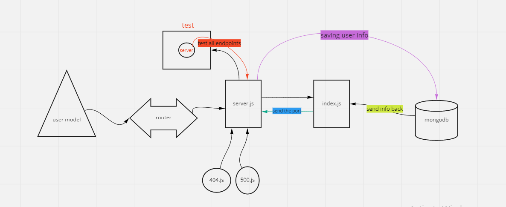

# basic-auth

*Auther: Abeer Rafati*

**This app to explain how to creat a sign up and sign in by basic auth**   

[Produchion deployment](https://class04.herokuapp.com/)    
[Pull req](https://github.com/AbeerAl-Rafati/api-server/pull/2)   

*To use this app:*
- clone this repo  
- `cd First_api_server` 
- to download all dependencies used in this app, use in terminal 
> `npm i` 
- to run the server use in terminal  
> `nodemon` 
> try to use `api/v1/food` and `api/v1/clothes` to show data
- to run test it use in termintl 
> `npm test`    

